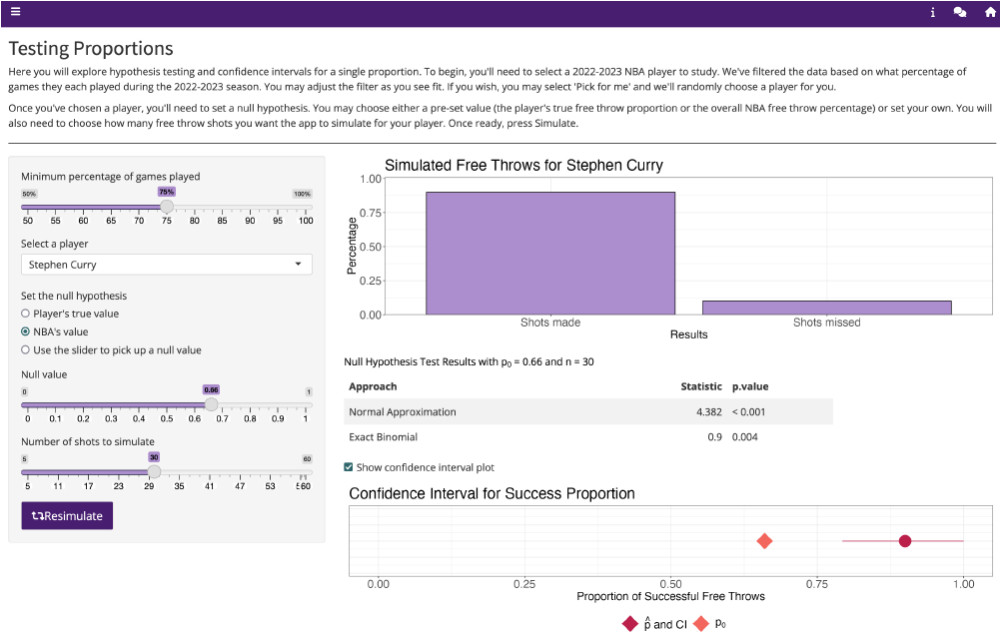

# Hypothesis Testing

  

# App Description
This app focuses on tests for proportions in a sports context (basketball free throw shooting). The app illustrates how a change in the population caused by filtering can change the results and also illustrates the difference between p, p̂, and p0.
